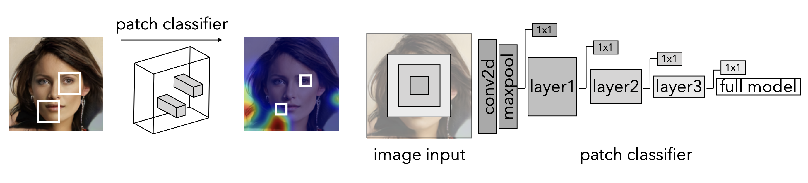

# What makes fake images detectable? Understanding properties that generalize
###  Lucy Chai, David Bau, Ser-Nam Lim, and Phillip Isola

This repository is for a presentation on "What makes fake images detectable? Understanding properties that generalize" by Lucy Chai, David Bau, Ser-Nam Lim, and Phillip Isola; given by James Ecker to CS895

[Power Point](https://github.com/jim-ecker/cs895-f20/blob/master/assignments/Ecker/week-09-chai-patch-classification/week-09-chai-patch-classification.pptx)

[Google Slides](https://docs.google.com/presentation/d/1WymQsQN5TD6KpwUk9ifyJGUd72-qDg58/edit#slide=id.p1)
